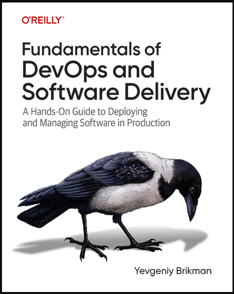

# github-ci-test

Solutions for the exercises from the [Fundamentals of DevOps Part 5: How to set up CI and CD ](https://www.gruntwork.io/fundamentals-of-devops/setup-ci-cd#how_to_set_up_ci_cd)



## Exercises

1. To help catch bugs, update the GitHub Actions workflow to run a JavaScript linter, such as [JSLint](https://www.jslint.com/) or [ESLint](https://eslint.org/), after every commit.
2. To help keep your code consistently formatted, update the GitHub Actions workflow to run a code formatter, such as [Prettier](https://prettier.io/), after every commit.
3. Run both the linter and code formatter as a precommit hook, so these checks run on your own computer before you can make a commit. You may wish to use the [pre-commit](https://pre-commit.com/) framework to manage your precommit hooks.
4. Ensure that GitHub is authenticated to AWS and able to perform `tofu test` command for unit testing.
5. To help keep your code consistently formatted, update the GitHub Actions workflow to run a code formatter, such as `tofu fmt`, after every commit.
6. Create remote S3 backend for OpenTofu files. To see the changes, have a look at `add-s3-remote-backend` branch
7. You’re probably annoyed by all the copy/paste you need to do with these backend configurations. Unfortunately, OpenTofu does not support using variables or any other kind of logic in backend blocks, so some amount of copy/paste is necessary. However, you can try out one of the following approaches to significantly reduce the code duplication:
   - [OpenTofu partial configuration](https://opentofu.org/docs/language/settings/backends/configuration/#partial-configuration)
   - [Terragrunt](https://terragrunt.gruntwork.io/)
8. Create your own version of the `gh-actions-iam-roles` module that you can use for deploying other types of infrastructure, and not just Lambda functions: e.g., try to create IAM roles for deploying EKS clusters, EC2 instances, and so on

## Adding ESLint step

For more information about ESLint refer to [Getting Stared](https://eslint.org/docs/latest/use/getting-started) guide

To initalize the ESlint package run:

```bash
npm init @eslint/config@latest
```

To run the lint tests:

```bash
npm run lint
```

## Adding Prettier step

To install prettier:

```bash
npm install --save-dev --save-exact prettier
```

To learn more, see [Prettier](https://prettier.io/docs/en/install)

## Adding pre-commit hook

To install pre-commit run:

```bash
pip install pre-commit
```

To check the installation:

```bash
pre-commit --version
```

To learn more, see [pre-commit](https://pre-commit.com/#install)

Create and configure `.pre-commit-config.yaml` config file with ESlint and Prettier

To install the hooks from the config file, run:

```bash
pre-commit install
```

To test the installed hooks and run against all files in the root of the project, run:

```bash
pre-commit run --all-files
```

## Adding code formatter step for tofu

To add code formatter step, use the `opentofu/setup-opentofu@v1` action and run `tofu fmt` command

## Refactor S3 backend configuration with Terragrunt

[Terragrunt](https://terragrunt.gruntwork.io/) allows to avoid code duplications in Terraform/OpenTofu files and adhere your code to [DRY](https://en.wikipedia.org/wiki/Don%27t_repeat_yourself) principles.

To install Terragrunt, see [installation](https://terragrunt.gruntwork.io/docs/getting-started/install/).

To learn more about configuring S3 remote backend with Terragrunt, see ["Keep your remote state configuration DRY"](https://terragrunt.gruntwork.io/docs/features/keep-your-remote-state-configuration-dry/)

For example, the common structure for Terragrunt files looks like the following:

```bash
├── terragrunt.hcl
├── backend-app
│   ├── main.tf
│   └── terragrunt.hcl
├── frontend-app
│   ├── main.tf
│   └── terragrunt.hcl
├── mysql
│   ├── main.tf
│   └── terragrunt.hcl
└── vpc
    ├── main.tf
    └── terragrunt.hcl
```

**NOTE**  
The given solution uses `generate "backend"` block to create `backend.tf` files from scratch in each module.

To avoid code duplication across multiple OpenTofu (Terraform) modules using Terragrunt, you can move the backend configuration into a `terragrunt.hcl` file. This allows you to centralize the backend configuration and reuse it across multiple modules.

1. Define your backend configuration in a `terragrunt.hcl` file at a common location (e.g., the root folder), which will be referenced by other module directories.
2. Create a `terragrunt.hcl` in each module: In each module, create a `terragrunt.hcl` file that includes the common configuration file. This ensures each module uses the same backend settings without duplicating the code.

Example for a module folder: `module-folder/terragrunt.hcl`:

```terraform
include {
  path = find_in_parent_folders() # Finds the common terragrunt.hcl in the parent folder
}
```
